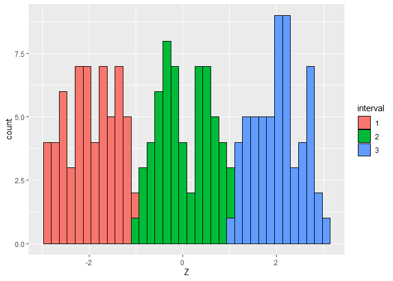
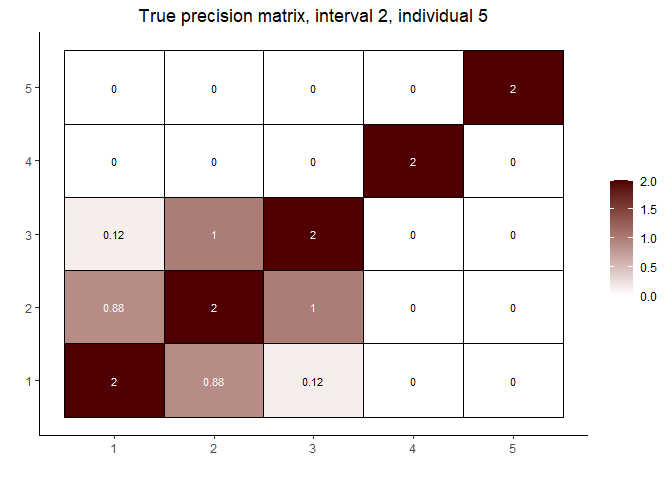
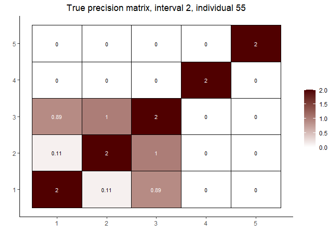
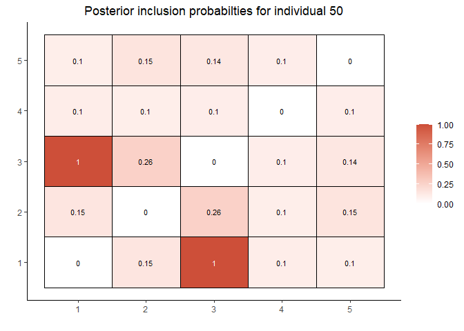
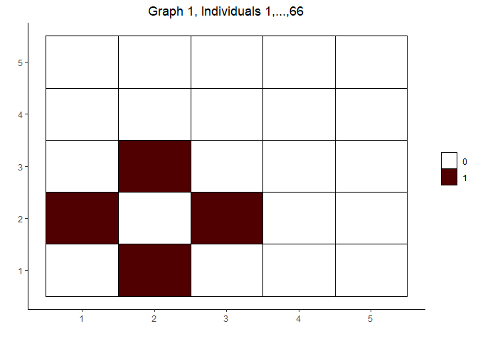
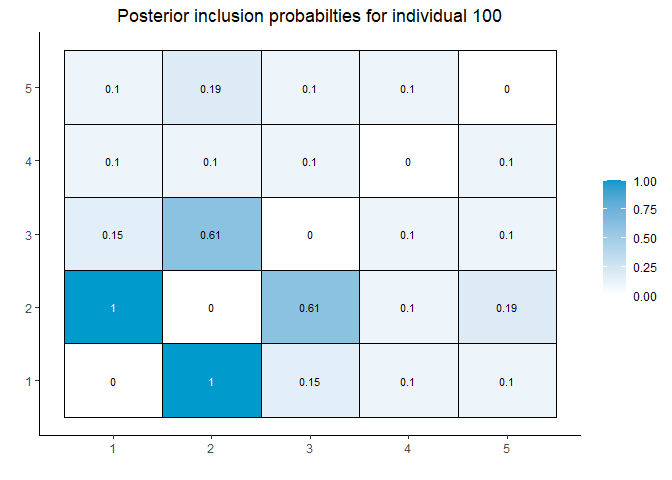
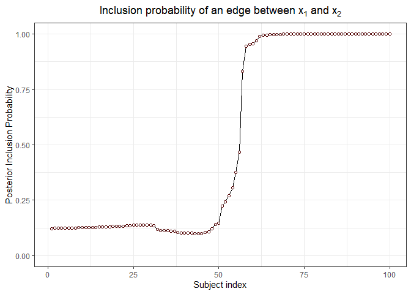

# `covdepGE:` Covariate Dependent Graph Estimation

## Installation

Run the following in `R`:

`devtools::install_github("JacobHelwig/covdepGE")`

## Overview

Suppose **X** ∈ ℝ<sup>*n* × *p*</sup> is a data matrix of independent
observations **X** = (**x**<sub>1</sub>,...,**x**<sub>*p*</sub>), where,
for *j* ∈ 1, ..., *p*:

           **x**<sub>*j*</sub> ∼ 𝒩(*μ*<sub>*j*</sub>,*Σ*<sub>*j*, *j*</sub>), **x**<sub>*j*</sub> ∈ ℝ<sup>*n*</sup>      **X** ∼ 𝒩(*μ*,*Σ*)

The conditional dependence structure of
**x**<sub>**1**</sub>, ..., **x**<sub>**p**</sub> can be modeled as an
undirected graph 𝒢 such that:

               𝒢<sub>*i*, *j*</sub> = 𝕀(Cov(**x**<sub>**i**</sub>,**x**<sub>**j**</sub>)≠0)

That is, there is an edge between the **x**<sub>**i**</sub> and
**x**<sub>**j**</sub> nodes if, and only if, these variables are
dependent on each other given all other variables.

Let **Z** be an *n* × *p*′ matrix of extraneous covariates. Further
suppose that the conditional dependence structure of **X** is not
homogeneous across the individuals, and is instead a continuous function
of the extraneous covariates **Z**(1). Then, this methodology aims to
estimate a graph for each of the individuals, possibly unique to the
individual, such that similar estimates are made for those who are
similar to one another in terms of the extraneous covariates.

For an example application, see (1), wherein the sample was composed of
healthy and cancerous individuals,
**x**<sub>1</sub>, ..., **x**<sub>8</sub> were protein expression levels
of 8 genes, and **Z** was the copy number variation of a gene **z**
associated with cancer,
**z** ∉ {**x**<sub>1</sub>, ..., **x**<sub>8</sub>}.

## Functionality

The main function, `covdepGE::covdepGE(`**X**, **Z**`)`, estimates the
posterior distribution of the graphical structure 𝒢<sub>*l*</sub> for
each of the *n* individuals using a variational mean-field
approximation. The function will output *n* *p* × *p* symmetric matrices
𝒜<sub>*l*</sub>, where 𝒜<sub>*i*, *j*</sub><sup>(*l*)</sup> is the
posterior inclusion probability of an edge between the node representing
the *i*-th variable and the node representing the *j*-th variable.

There are also two plotting functions, `gg_adjMat` and
`gg_inclusionCurve`, for visualizing the result of `covdepGE`. The
primary functionality of `gg_adjMat` is to visualize the estimate to a
specified individuals conditional dependence structure, however, it can
also be used to visualize any numeric matrix. `gg_inclusionCurve` plots
the posterior inclusion probability of an edge between two specified
variables across all *n* individuals.

## Demo

``` r
# install the package if necessary
if  (!("covdepGE" %in% installed.packages())){
  devtools::install_github("JacobHelwig/covdepGE")
}

library(covdepGE)

set.seed(1)
n <- 100
p <- 4

# generate the extraneous covariate
Z_neg <- sort(runif(n / 2) * -1)
Z_pos <- sort(runif(n / 2))
Z <- c(Z_neg, Z_pos)
summary(Z)
```

    ##     Min.  1st Qu.   Median     Mean  3rd Qu.     Max. 
    ## -0.99191 -0.55799  0.02277 -0.01475  0.45622  0.96062

``` r
# create true covariance structure for 2 groups: positive Z and negative Z
true_graph_pos <- true_graph_neg <- matrix(0, p + 1, p + 1)
true_graph_pos[1, 2] <- true_graph_pos[2, 1] <- 1
true_graph_neg[1, 3] <- true_graph_neg[3, 1] <- 1

# visualize the true covariance structures
(gg_adjMat(true_graph_neg) +
    ggplot2::ggtitle("True graph for individuals with negative Z (1,...,50)"))
```

<!-- -->

``` r
(gg_adjMat(true_graph_pos, color1 = "steelblue") +
    ggplot2::ggtitle("True graph for individuals with positive Z (51,...,100)"))
```

<!-- -->

``` r
# generate the covariance matrices as a function of Z
sigma_mats_neg <- lapply(Z_neg, function(z) z * true_graph_neg + diag(p + 1))
sigma_mats_pos <- lapply(Z_pos, function(z) z * true_graph_pos + diag(p + 1))
sigma_mats <- c(sigma_mats_neg, sigma_mats_pos)

# generate the data using the covariance matrices
data_mat <- t(sapply(sigma_mats, MASS::mvrnorm, n = 1, mu = rep(0, p + 1)))

# visualize the sample correlation within each group
(gg_adjMat(abs(cor(data_mat[1:(n / 2), ])) - diag(p + 1)) + 
    ggplot2::ggtitle("Correlation Matrix for Negative Z (1,...,50)"))
```

<!-- -->

``` r
(gg_adjMat(abs(cor(data_mat[(n / 2 + 1):n, ])) - diag(p + 1),
          color1 = "steelblue") + 
    ggplot2::ggtitle("Correlation Matrix for Positive Z (51,...,100)"))
```

<!-- -->

``` r
# use varbvs to get the hyperparameter sigma
sigmasq <- rep(NA, p + 1)
for (j in 1:(p + 1)){
  sigmasq[j] <- mean(varbvs::varbvs(data_mat[ , -j], Z, data_mat[ , j], verbose = F)$sigma)
}
#sigmasq
#mean(sigmasq)

# estimate the covariance structure
#?covdepGE
out <- covdepGE(
                data_mat,
                Z, # extraneous covariates
                kde = T, # whether KDE should be used to calculate bandwidths 
                sigmasq = mean(sigmasq), # hyperparameter residual variance 
                var_min = 1e-4, # smallest sigmabeta_sq grid value
                var_max = 1, # largest sigmabeta_sq grid value
                n_sigma = 10, # length of the sigmabeta_sq grid
                pi_vec = seq(0.1, 0.3, 0.05), # prior inclusion probability grid
                norm = Inf, # norm to calculate the weights
                scale = T, # whether the extraneous covariates should be scaled
                tolerance = 1e-15, # variational parameter exit condition 1
                max_iter = 200, # variational parameter exit condition 2
                edge_threshold = 0.75, # minimum inclusion probability
                sym_method = "min", # how to symmetrize the alpha matrices
                print_time = T, 
                warnings = T # whether warnings should be displayed
                )
```

    ## Warning in covdepGE(data_mat, Z, kde = T, sigmasq = mean(sigmasq), var_min =
    ## 1e-04, : Response 1: 3/50 candidate models did not converge in 200 iterations

    ## Warning in covdepGE(data_mat, Z, kde = T, sigmasq = mean(sigmasq), var_min =
    ## 1e-04, : Response 2: 17/50 candidate models did not converge in 200 iterations

    ## Warning in covdepGE(data_mat, Z, kde = T, sigmasq = mean(sigmasq), var_min =
    ## 1e-04, : Response 2: final model did not converge in 200 iterations

    ## Warning in covdepGE(data_mat, Z, kde = T, sigmasq = mean(sigmasq), var_min =
    ## 1e-04, : Response 3: 17/50 candidate models did not converge in 200 iterations

    ## Warning in covdepGE(data_mat, Z, kde = T, sigmasq = mean(sigmasq), var_min =
    ## 1e-04, : Response 3: final model did not converge in 200 iterations

    ## Warning in covdepGE(data_mat, Z, kde = T, sigmasq = mean(sigmasq), var_min =
    ## 1e-04, : For 1/5 responses, the selected value of sigmabeta_sq was on the grid
    ## boundary. See return value ELBO for details

    ## Warning in covdepGE(data_mat, Z, kde = T, sigmasq = mean(sigmasq), var_min =
    ## 1e-04, : For 5/5 responses, the selected value of pi was on the grid boundary.
    ## See return value ELBO for details

    ## Time difference of 3.65831 secs

``` r
# grid search results
#out$ELBO

# individual-specific bandwidths calculated using KDE
#out$bandwidths

# analyze results
#?gg_adjMat
gg_adjMat(out, 1, color1 = "coral1")
```

<!-- -->

``` r
gg_adjMat(out, 50, color1 = "tomato3")
```

<!-- -->

``` r
gg_adjMat(out, 60, color1 = "steelblue")
```

<!-- -->

``` r
gg_adjMat(out, 100, color1 = "deepskyblue3")
```

<!-- -->

``` r
#?gg_inclusionCurve
gg_inclusionCurve(out, 1, 2)
```

<!-- -->

``` r
gg_inclusionCurve(out, 1, 3, point_color = "dodgerblue")
```

<!-- -->

``` r
# find sensitivity, specificity, and accuracy

# true positives
TP_neg <- sum(sapply(out$graphs[1:(n / 2)],
                     function(graph) sum(graph == 1 & true_graph_neg == 1)))
TP_pos <- sum(sapply(out$graphs[(n / 2 + 1):n],
                     function(graph) sum(graph == 1 & true_graph_pos == 1)))
TP <- TP_neg + TP_pos

# total positives
num_pos <- sum(true_graph_pos) * n / 2 + sum(true_graph_neg) * n / 2

# true negatives
TN_neg <- sum(sapply(out$graphs[1:(n / 2)],
                     function(graph) sum(graph == 0 & true_graph_neg == 0)))
TN_pos <- sum(sapply(out$graphs[(n / 2 + 1):n],
                     function(graph) sum(graph == 0 & true_graph_pos == 0)))
TN <- TN_neg + TN_pos

# total negatives
num_neg <- length(true_graph_pos) * n - num_pos

(sensitivity <- TP / num_pos)
```

    ## [1] 0.94

``` r
(specificity <- TN / num_neg)
```

    ## [1] 0.9686957

``` r
(accuracy <- (TN + TP) / (num_pos + num_neg))
```

    ## [1] 0.9664

## To-do

-   Topic 16 slides ideas

-   2 ideas from `Mclust`: logo and loading bar

``` r
#    ______________  __ _____________________________
#   / ____/ _   / / / / _   / ____/ __  / ____/ ____/ 
#  / /   / / / / / / / / / / __/ / ___ / / _ / __/ 
# / /___/ /_/ /\ \/ /\ \/ / /___/ /   / /_/ / /___ 
# \____/\____/  \__/  \__/_____/_/    \____/_____/
```

-   Change the weight calculation loop so that the inner loop range is
    constant, no matter `kde`

-   Add Carbonetto-Stephens reference in documentation

-   Check how to refer to *σ*<sup>2</sup> (regression coefficient
    variance) and *σ*<sub>*β*</sub><sup>2</sup> (slab variance)

-   Create a vignette demonstrating usage on a simple simulated dataset

-   Model details in return

-   Change the `idmod` probs to logbase 10

-   Remove `CS` argument

-   Parallelization of the “main loop” over the predictors in
    `covdepGE_main.R`. This is complicated by the `C++` code, however,
    two potential solutions are:

    -   <span style="color: blu">[StackOverflow
        suggestion](https://stackoverflow.com/questions/69789634/parallelization-of-rcpp-without-inline-creating-a-local-package?noredirect=1#comment123649680_69789634)</span>

    -   <span
        style="color: blu">[RcppParallel](https://cran.r-project.org/web/packages/RcppParallel/index.html)</span>

## Bibliography

1.  Dasgupta S., Ghosh P., Pati D., Mallick B. “An approximate Bayesian
    approach to covariate dependent graphical modeling.” 2021
