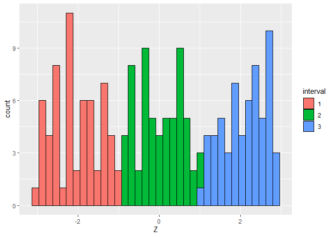
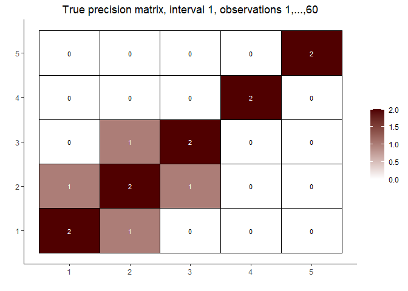
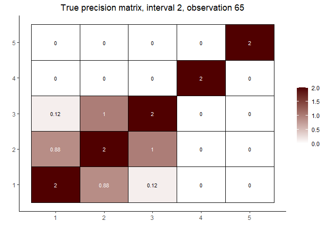
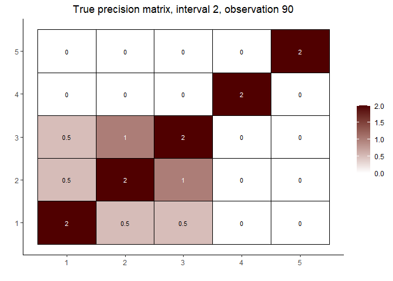
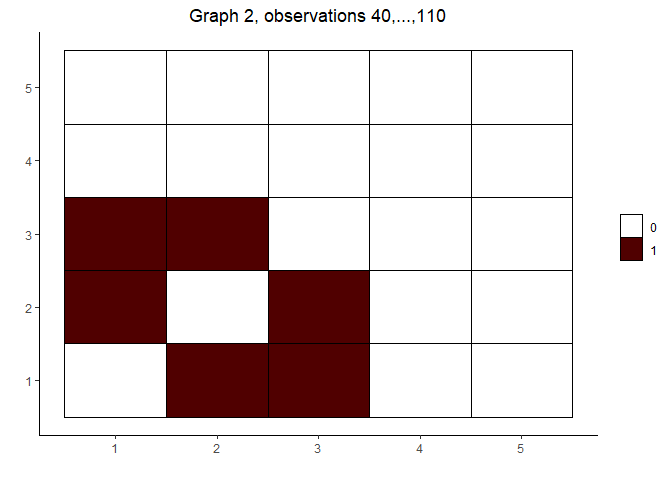
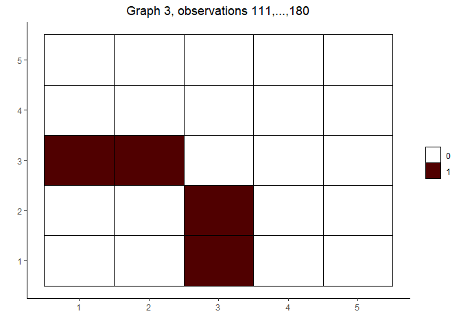
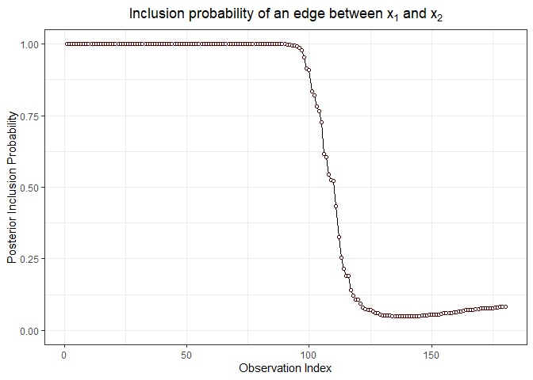
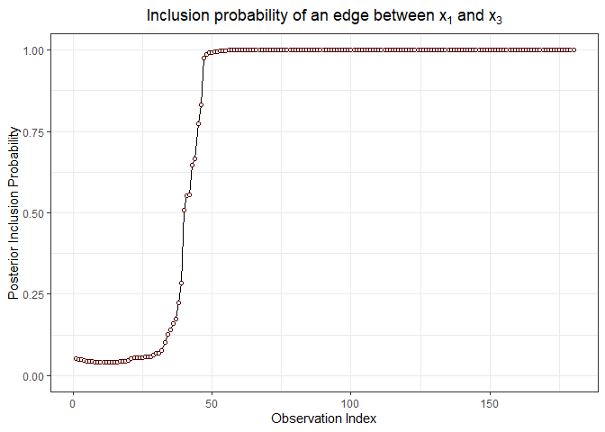

<!-- Re-knit 'README.Rmd' with `devtools::build_readme()` -->
<!-- README.md is generated from README.Rmd. Please edit that file -->

# covdepGE

<!-- badges: start -->

[](https://app.codecov.io/gh/JacobHelwig/covdepGE?branch=master)
[](https://github.com/JacobHelwig/covdepGE/actions/workflows/R-CMD-check.yaml)
[](https://CRAN.R-project.org/package=covdepGE)
<!-- badges: end -->

The conditional dependence structure (CDS) of a data matrix with $p$
variables can be modeled as an undirected graph with $p$ vertices, where
two variables are connected if, and only if, the two variables are
dependent given the remaining variables in the data. Gaussian graphical
modeling (GGM) seeks to capture the CDS of the data under the assumption
that the data are normally distributed. This distributional assumption
is convenient for inference, as the CDS is given by the sparsity
structure of the precision matrix, where the precision matrix is defined
as the inverse covariance matrix of the data.

There is extensive GGM literature and many R packages for GGM, however,
all make the restrictive assumption that the precision matrix is
homogeneous throughout the data, or that there exists a partition of
homogeneous subgroups. `covdepGE` avoids this strong assumption by
utilizing information sharing to model the CDS as varying continuously
with an extraneous covariate. Intuitively, this implies that
observations having similar extraneous covariate values will have
similar precision matrices.

To facilitate information sharing while managing complexity, `covdepGE`
uses an efficient variational approximation conducted under the novel
weighted pseudo-likelihood framework proposed by (1). `covdepGE` further
accelerates inference by employing parallelism and executing expensive
iterative computations in C++. Additionally, `covdepGE` offers a
principled, data-driven approach for hyperparameter specification that
only requires the user to input data and extraneous covariates to
perform inference. Finally, `covdepGE` offers several wrappers around
`ggplot2` for seamless visualization of resulting estimates, such as
`matViz`, `inclusionCurve`, and the S3 method `plot.covdepGE`.

## Installation

You can install the released version of covdepGE from
[CRAN](https://cran.r-project.org/package=covdepGE) with:

``` r
install.packages("covdepGE")
```

And the development version from
[GitHub](https://github.com/JacobHelwig/covdepGE) with:

``` r
# install.packages("devtools")
devtools::install_github("JacobHelwig/covdepGE")
```

## Contributing

If you have an idea to improve `covdepGE`, considering [forking the
repo](https://github.com/JacobHelwig/covdepGE/fork) and creating a pull
request or [opening an
issue](https://github.com/JacobHelwig/covdepGE/issues).

## Example

``` r
library(covdepGE)
library(ggplot2)

# get the data
set.seed(12)
data <- generateData()
X <- data$X
Z <- data$Z
interval <- data$interval
prec <- data$true_precision

# get overall and within interval sample sizes
p <- ncol(X)
n <- nrow(X)
n1 <- sum(interval == 1)
n2 <- sum(interval == 2)
n3 <- sum(interval == 3)

# visualize the distribution of the extraneous covariate
ggplot(data.frame(Z = Z, interval = as.factor(interval))) +
  geom_histogram(aes(Z, fill = interval), color = "black", bins = n %/% 5)
```



``` r

# visualize the true precision matrices in each of the intervals

# interval 1
matViz(prec[[1]], incl_val = TRUE) +
  ggtitle(paste0("True precision matrix, interval 1, observations 1,...,", n1))
```



``` r

# interval 2 (varies continuously with Z)
cat("\nInterval 2, observations ", n1 + 1, ",...,", n1 + n2, sep = "")
#> 
#> Interval 2, observations 61,...,120
int2_mats <- prec[interval == 2]
int2_inds <- c(5, n2 %/% 2, n2 - 5)
lapply(int2_inds, function(j) matViz(int2_mats[[j]], incl_val = TRUE) +
         ggtitle(paste("True precision matrix, interval 2, observation", j + n1)))
#> [[1]]
```



    #> 
    #> [[2]]



    #> 
    #> [[3]]


``` r

# interval 3
matViz(prec[[length(prec)]], incl_val = TRUE) +
  ggtitle(paste0("True precision matrix, interval 3, observations ",
                 n1 + n2 + 1, ",...,", n1 + n2 + n3))
```


``` r

# fit the model and visualize the estimated graphs
(out <- covdepGE(X, Z, parallel = T, num_workers = p))
#> Warning in covdepGE(X, Z, parallel = T, num_workers = p): No registered workers
#> detected; registering doParallel with 5 workers
#>                       Covariate Dependent Graphical Model
#> 
#> ELBO: -171501.68                                             # Unique Graphs: 3
#> n: 180, variables: 5                       Hyperparameter grid size: 125 points
#> Model fit completed in 3.328 secs
plot(out)
#> [[1]]
```


    #> 
    #> [[2]]



    #> 
    #> [[3]]



``` r

# visualize the posterior inclusion probabilities for variables (1, 3) and (1, 2)
inclusionCurve(out, 1, 2)
```



``` r
inclusionCurve(out, 1, 3)
```



## Methods

Math is correctly rendered in the version of this document available on
[CRAN](https://CRAN.R-project.org/package=covdepGE/readme/README.html).

### Overview

Suppose that $X$ is a $p$-dimensional data matrix with $n$ observations
and that $Z$ is a $q$-dimensional extraneous covariate, also with $n$
observations, where the $l$-th observation in $Z$ is associated with the
$l$-th observation in $X$. Further suppose that the $l$-th row of $X$
follows a $p$-dimensional Gaussian distribution with mean $0$ and
precision matrix $\Omega(z_l)$, where $z_l$ is the $l$-th entry of $Z$
and $\Omega$ is a continuous function mapping from the space of
extraneous covariates to the space of $p \times p$ non-singular
matrices. Then, for the $l$-th observation, the $(j,k)$ entry of
$\Omega(z_l)$ is non-zero if, and only if, variable $j$ and variable $k$
are dependent given the remaining variables in $X$.

Given data satisfying these assumptions, the `covdepGE` function employs
the algorithm described in (1) to estimate a graphical representation of
the structure of $\Omega$ for each of the observations in $X$ as a
continuous function of $Z$. This graph contains an undirected edge
between two variables $X_j$ and $X_k$ if, and only if, $X_j$ and $X_k$
are conditionally dependent given the remaining variables. Core
components of this methodology are the weighted pseudo-likelihood
framework in which inference is conducted via a block mean-field
variational approximation.

### Graph Estimation

Graphs are constructed using a pseudo-likelihood approach by fixing each
of the columns $X_j$ of $X$ as the response and performing a
spike-and-slab regression using the remaining variables $X_k$ in $X$ as
predictors. To determine if an edge should be added between $X_j$ and
$X_k$, the posterior inclusion probability of $X_k$ in a regression with
$X_j$ fixed as the response ($PIP_j(X_k)$) and vice versa ($PIP_k(X_j)$)
are symmetrized according to `sym_method` (e.g., by taking the mean of
$PIP_k(X_j)$ and $PIP_j(X_k)$). If the symmetrized $PIP$ is greater than
`edge_threshold`, an edge will be included between $X_j$ and $X_k$.

To model $\Omega$ as a function of $Z$, $n$ weighted spike-and-slab
regressions are performed for each variable $X_j$ fixed as the response.
The similarity weights for the $l$-th regression are taken with respect
to observation $l$ such that observations having similar values of $Z$
will have larger weights. These similarity weights in conjunction with
the pseudo-likelihood framework comprise the weighted pseudo-likelihood
approach introduced by (1). Note that model performance is best when
$n > p$.

### Variational Inference

Spike-and-slab posterior quantities are estimated using a block
mean-field variational approximation. Coordinate Ascent Variational
Inference (CAVI) is performed for each of the weighted regressions to
select the variational parameters that maximize the ELBO. The parameters
for each of the regression coefficients are the mean and variance of the
slab ($\mu$ and $\sigma^2_{\text{var}}$, respectively) and the
probability that the coefficient is non-zero ($\alpha$). $\mu$ and
$\alpha$ for all coefficients are initialized as $0$ and $0.2$,
respectively.

CAVI for the $n$ regressions is performed simultaneously for variable
$X_j$ fixed as the response. With each of the $n$ sets of $\alpha$ as
the rows of an $n \times (p - 1)$ matrix, the CAVI for variable $X_j$ is
ended for all $n$ regressions when the Frobenius norm of the change in
the $\alpha$ matrix is less than `alpha_tol` or after `max_iter`
iterations of CAVI have been performed.

Note that since the regressions performed for variable $X_j$ and $X_k$
fixed as the response are independent of each other, they may be
performed in parallel by setting `parallel = T`. Registering parallel
backend with greater than $p$ workers offers no benefit, since each
worker takes on one variable to fix as the response and perform the $n$
regressions.

### Hyperparameter specification

Each regression requires the specification of $3$ hyperparameters: $\pi$
(the prior probability of inclusion), $\sigma^2$ (the prior residual
variance), and $\sigma_\beta^2$ (the prior variance of the slab).
`covdepGE` offers $3$ methods for hyperparameter specification via the
`hp_method` argument: `grid_search`, `model_average`, and `hybrid`.
Empirically, `grid_search` offers the best sensitivity and
`model_average` offers the best specificity, while `hybrid` sits between
the other two methods in both metrics.

The hyperparameter candidate grid is generated by taking the Cartesian
product between `ssq`, `sbsq`, and `pip` (candidate values for
$\sigma^2$, $\sigma_\beta^2$, and $\pi$, respectively). Each of the
methods gives an approach for selecting points from this grid.

In `grid_search`, the point from the grid that produces the model that
has the greatest total ELBO is selected, where the total ELBO is
calculated by summing the ELBO for each of the $n$ regressions for a
variable $X_j$ fixed as the response. Thus, all observations use the
same set of hyperparameters for the regression on $X_j$.

Instead of selecting only one model as in `grid_search`, models are
averaged over in `model_average`. With $X_j$ fixed as the response, the
unnormalized weights for each grid point used to perform this averaging
is calculated by exponentiating the ELBO for each of the $n$
regressions. Note that since the ELBO for a given grid point will vary
across the $n$ regressions due to differing similarity weights, each of
the $n$ sets of averaging weights will be unique.

Finally, `hybrid` combines `grid_search` and `model_average`. Fixing
$X_j$ as the response, for each $\pi$ candidate in `pip`, the point in
the grid defined by the Cartesian product of `ssq` and `sbsq` is
selected by maximizing the total ELBO summed across the $n$ regressions.
The resulting models for each of the $\pi$ candidates are then averaged
using the exponentiated ELBO for each of the $n$ regressions as the
unnormalized averaging weights.

Note that in the search step of `grid_search` and `hybrid`, CAVI for
each of the grid points is performed for at most `max_iter_grid`
iterations. A second CAVI is then performed for `max_iter` iterations
using the $n$ models that maximized the total ELBO in the first step.
Setting `max_iter_grid` to be less than `max_iter` (as is the default)
will result in a more efficient search.

### Candidate grid generation

The candidate grids (`ssq`, `sbsq`, and `pip`) may be passed as
arguments, however, by default, these grids are generated automatically.
Each of the grids are spaced uniformly between an upper end point and
lower end point. The number of points in each grid is $5$ by default.
Grids include end points, and the number of points in each grid is
controlled by the arguments `nssq`, `nsbsq`, and `npip`. The lower
endpoints (`ssq_lower`, `sbsq_lower`, and `pip_lower`) are all `1e-5` by
default. The upper endpoints are calculated dependent on the variable
$X_j$ fixed as the response.

`ssq_upper` is simply the variance of $X_j$ times `ssq_mult`. By
default, `ssq_mult` is `1.5`.

`pip_upper` is calculated by regressing the remaining variables on $X_j$
using LASSO. The shrinkage hyperparameter for LASSO is chosen to be
`lambda.1se`. The number of non-zero coefficients estimated by LASSO is
then divided by `p - 1` to calculate `pip_upper`. Note that if the LASSO
estimate to the number of non-zero coefficients is $0$ or $p - 1$, this
estimate is changed to $1$ or $p - 2$ (respectively) to ensure that
`pip_upper` is greater than $0$ and less than $1$.

Finally, an upper bound is induced on $\sigma_\beta^2$ by deriving a
rough upper bound for the signal-to-noise ratio that depends on
$\sigma_\beta^2$. Let $S^2$ be the sum of the sample variances of the
columns of the predictors $X’$. Under the simplifying assumptions that
the expected values of $X’$ and the spike-and-slab regression
coefficients $\beta$ are $0$ and that $X’$ and $\beta$ are independent,
the variance of the dot product of $X’$ with $\beta$ is
$\pi\cdot \sigma^2 \cdot\sigma_\beta^2\cdot S^2$. Thus, the
signal-to-noise ratio under these assumptions is given by
$\pi\cdot \sigma_\beta^2\cdot S^2$. Replacing $\pi$ with `pip_upper` and
$\sigma_\beta^2$ with `sbsq_upper` gives an upper bound on the
signal-to-noise ratio. Setting this bound equal to `snr_upper` gives an
expression for `sbsq_upper`.

### Similarity Weights

The similarity weight for observation $k$ with respect to observation
$l$ is $\phi_{\tau_l}(||z_l - z_k||)$. Here, $|| \cdot ||$ denotes the
norm specified by the `norm` argument, $z_l$ and $z_k$ are the values of
$Z$ for the $l$-th and $k$-th observations, $\phi_{\tau_l}$ is the
univariate Gaussian density with standard deviation $\tau_l$, and
$\tau_l$ is the bandwidth for the $l$-th observation.

`tau` may be passed as an argument, however, by default, it is estimated
using the methodology given in (2). (2) describes a two-step approach
for density estimation, where in the first step, an initial estimate is
calculated using Silverman’s rule of thumb for initializing bandwidth
values, and in the second step, the density is refined by updating the
bandwidth values. This methodology is used here to estimate the density
of $Z$, and the updated bandwidths from the second step are used for
`tau`.

### Bibliography

1)  Sutanoy Dasgupta, Peng Zhao, Prasenjit Ghosh, Debdeep Pati, and Bani
    Mallick. An approximate Bayesian approach to covariate-dependent
    graphical modeling. pages 1–59, 2022.

2)  Sutanoy Dasgupta, Debdeep Pati, and Anuj Srivastava. A Two-Step
    Geometric Framework For Density Modeling. *Statistica Sinica*,
    30(4):2155–2177, 2020.
