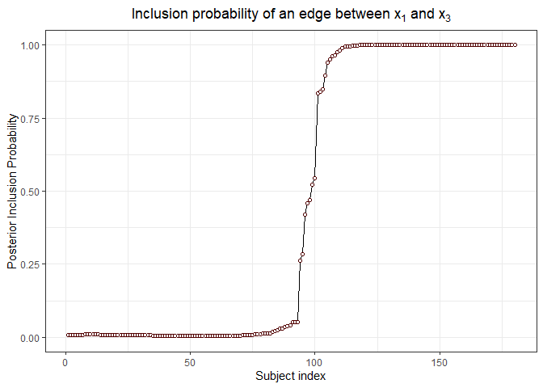

# `covdepGE:` Covariate Dependent Graph Estimation

## Installation

Run the following in `R`:

`devtools::install_github("JacobHelwig/covdepGE")`

## Overview

Suppose **X** ∈ ℝ<sup>*n* × *p*</sup> is a data matrix of independent
observations **X** = (**x**<sub>1</sub>,...,**x**<sub>*p*</sub>) such
that **X** ∼ 𝒩(*μ*,*Σ*). Then, using Gaussian graphical modeling
techniques, the conditional dependence structure of
**x**<sub>**1**</sub>, ..., **x**<sub>**p**</sub> can be modeled as an
undirected graph 𝒢 such that:

                  𝒢<sub>*i*, *j*</sub> = 𝕀(**x**<sub>**i**</sub>⊥**x**<sub>**j**</sub>  \|{**x**<sub>**1**</sub>,…,**x**<sub>**p**</sub>}\\{**x**<sub>**i**</sub>**,** **x**<sub>**j**</sub>})

That is, there is an edge between the **x**<sub>**i**</sub> and
**x**<sub>**j**</sub> nodes if, and only if, these variables are
dependent on each other given all other variables.

Let **Z** be an *n* × *p*′ matrix of extraneous covariates. Further
suppose that the conditional dependence structure of **X** is not
homogeneous across the individuals, and is instead a continuous function
of the extraneous covariates **Z**(1). Then, this methodology aims to
estimate a graph for each of the individuals, possibly unique to the
individual, such that similar estimates are made for those who are
similar to one another in terms of the extraneous covariates.

For an example application, see (1), wherein the sample was composed of
healthy and cancerous individuals,
**x**<sub>1</sub>, ..., **x**<sub>8</sub> were protein expression levels
of 8 genes, and **Z** was the copy number variation of a gene **z**
associated with cancer,
**z** ∉ {**x**<sub>1</sub>, ..., **x**<sub>8</sub>}.

## Functionality

The main function, `covdepGE::covdepGE(`**X**, **Z**`)`, estimates the
posterior distribution of the graphical structure 𝒢<sub>*l*</sub> for
each of the *n* individuals using a variational mean-field
approximation.

## Bibliography

1.  Dasgupta S., Ghosh P., Pati D., Mallick B. “An approximate Bayesian
    approach to covariate dependent graphical modeling.” 2021

## Demo

``` r
library(covdepGE)
library(ggplot2)

# get the data
set.seed(1)
data <- generate_continuous()
X <- data$data
Z <- data$covts
interval <- data$interval
prec <- data$true_precision

# get overall and within interval sample sizes
n <- nrow(X)
n1 <- sum(interval == 1)
n2 <- sum(interval == 2)

# visualize the distribution of the extraneous covariate
ggplot(data.frame(Z = Z, interval = as.factor(interval))) +
  geom_histogram(aes(Z, fill = interval), color = "black", bins = n %/% 5)
```

<!-- -->

``` r
# visualize the true precision matrices in each of the intervals

# interval 1
matViz(prec[[1]], incl_val = T) + ggtitle("True precision matrix, interval 1")
```

<!-- -->

``` r
# interval 2 (varies continuously with Z)
int2_mats <- prec[interval == 2]
int2_inds <- c(5, n2 %/% 2, n2 - 5)
lapply(int2_inds, function(j) matViz(int2_mats[[j]], incl_val = T) +
         ggtitle(paste("True precision matrix, interval 2, individual", j)))
```

    ## [[1]]

<!-- -->

    ## 
    ## [[2]]

<!-- -->

    ## 
    ## [[3]]

<!-- -->

``` r
# interval 3
matViz(prec[[length(prec)]], incl_val = T) +
  ggtitle("True precision matrix, interval 3")
```

<!-- -->

``` r
# fit the model and visualize the estimated precision matrices
(out <- covdepGE(X, Z))
```

    ##   |                                                                              |                                                                      |   0%  |                                                                              |==============                                                        |  20%  |                                                                              |============================                                          |  40%  |                                                                              |==========================================                            |  60%  |                                                                              |========================================================              |  80%  |                                                                              |======================================================================| 100%

    ##                       Covariate Dependent Graphical Model
    ## 
    ## ELBO: -187187.75                                             # Unique Graphs: 3
    ## n: 180, variables: 5                        Hyperparameter grid size: 27 points
    ## Model fit completed in 8.269 secs

``` r
plot(out)
```

    ## [[1]]

<!-- -->

    ## 
    ## [[2]]

<!-- -->

    ## 
    ## [[3]]

<!-- -->

``` r
# visualize the posterior inclusion probabilities for variables (1, 3) and (1, 2)
inclusionCurve(out, 1, 2)
```

<!-- -->

``` r
inclusionCurve(out, 1, 3)
```

<!-- -->
