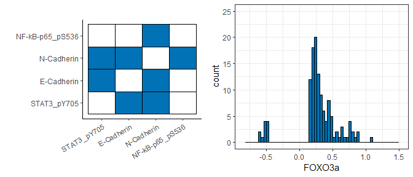
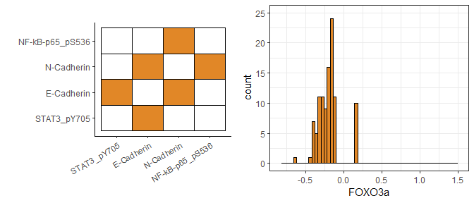
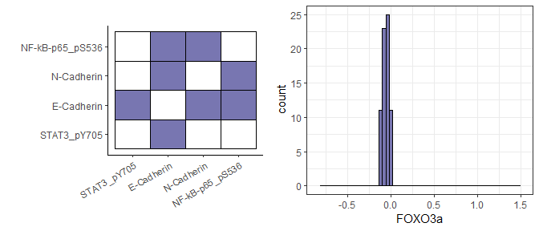
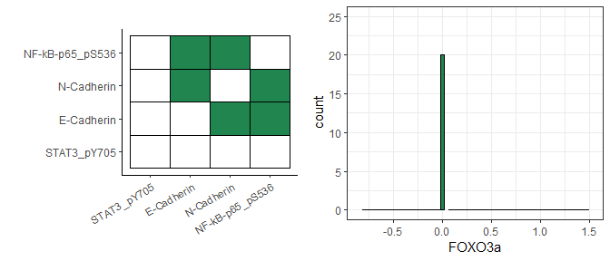
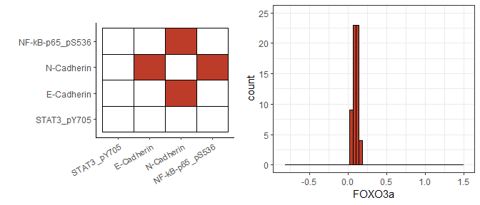

``` r
# BiocManager::install("RTCGA.BRCA")
library(RTCGA.RPPA)
library(covdepGE)
library(ggpubr)

# load data
dat <- RTCGA.RPPA::BRCA.RPPA
Z <- dat$FOXO3a
vars <- c("STAT3_pY705",
          "E-Cadherin",
          "N-Cadherin",
          "NF-kB-p65_pS536")
X <- dat[ , vars]

# fit model
out <- covdepGE(X, Z, parallel = T, num_workers = 4)
out
```

    ##                       Covariate Dependent Graphical Model
    ## 
    ## ELBO: -427095.08                                             # Unique Graphs: 5
    ## n: 410, variables: 4                       Hyperparameter grid size: 125 points
    ## Model fit completed in 5.535 secs

``` r
# returns graph visualization and histogram
plot_brca <- function(graph, z, xlim, ylim, color, labs, labz, bw){
  graph_viz <- matViz(graph, color2 = color) + 
    theme(legend.position='none', axis.text.x = element_text(angle=30,hjust=1,vjust=1.0)) + 
    scale_y_continuous(labels=labs, breaks=1:nrow(graph)) + 
    scale_x_continuous(labels=labs, breaks=1:nrow(graph))
  hist <- ggplot() + geom_histogram(aes(z), color='black', fill = color, binwidth = bw) + 
    xlab(labz) + theme_bw() + xlim(xlim) + ylim(c(0, ylim))
  list(graph_viz, hist)
}

# get graphs and corresponding observations
graphs <- lapply(out$graphs$unique_graphs, `[[`, "graph")
inds <- lapply(out$graphs$unique_graphs, `[[`, "indices")

# sort graphs by minimum Z value
ord <- order(sapply(inds, function(i) min(Z[i])))
colors <- ggsci::pal_nejm('default')(length(ord))

# plot results
get_graphs <- function(i){
  plot_brca(graph=graphs[[i]], z=Z[inds[[i]]], xlim=range(Z), ylim=25, color=colors[i], 
            labs=vars, labz="FOXO3a", bw=0.04)
}
plots_list <- Reduce(c, lapply(ord, get_graphs))
ggarrange(plotlist = plots_list, ncol=2)
```

    ## $`1`

<!-- -->

    ## 
    ## $`2`

<!-- -->

    ## 
    ## $`3`

<!-- -->

    ## 
    ## $`4`

<!-- -->

    ## 
    ## $`5`

<!-- -->

    ## 
    ## attr(,"class")
    ## [1] "list"      "ggarrange"
